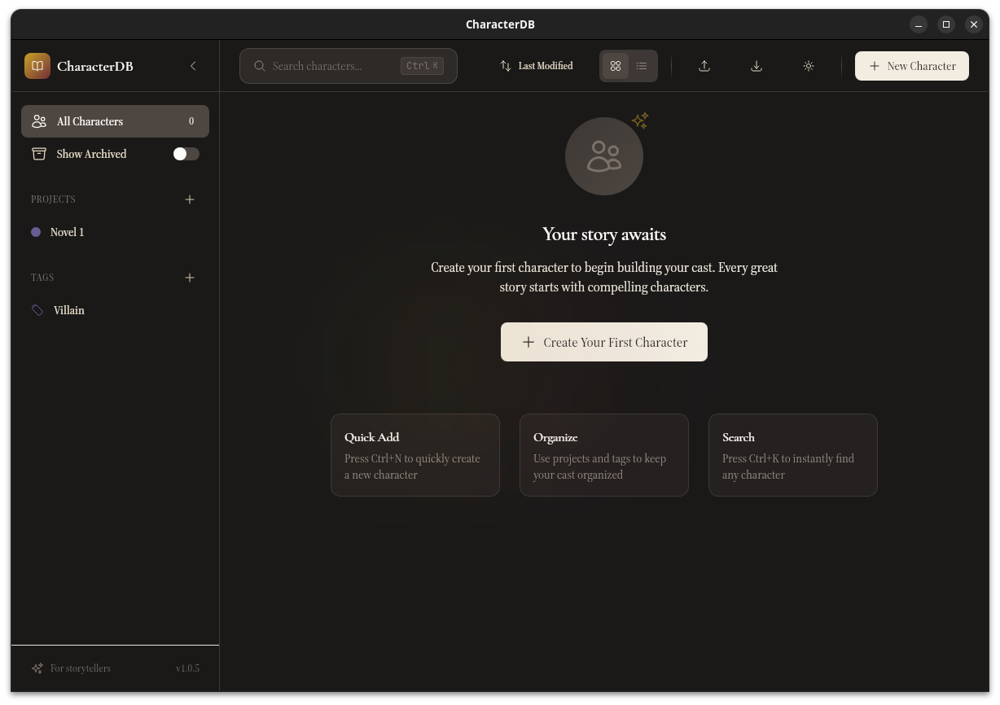
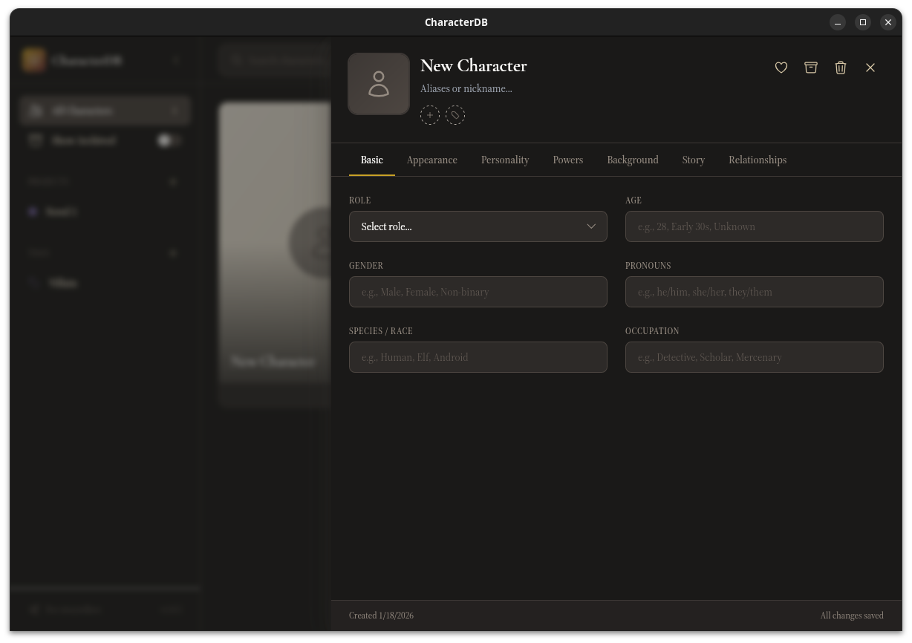
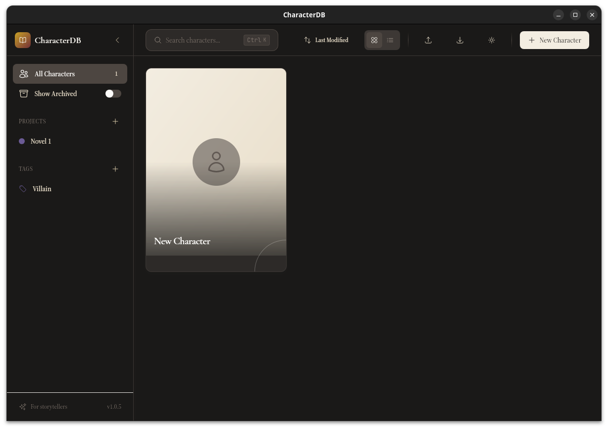

# CharacterDB

A desktop application for writers, game masters, and storytellers to create, organize, and manage their fictional characters. Built with React, TypeScript, and Tauri for a fast, native experience on Windows, macOS, and Linux.

---

## What is CharacterDB?

CharacterDB is your personal character bible. Whether you're writing a novel, running a tabletop RPG campaign, developing a video game, or building a fictional universe, CharacterDB helps you keep track of every detail about your characters. Their appearance, personality, powers, relationships, and story arcs.

**Key highlights:**

- Works completely offline,your characters stay on your computer
- Automatic saving, never lose your work
- Light and dark themes
- Organize characters by project and custom tags
- Track relationships between characters
- Export and backup your entire database
- D&D mode to track basic stats for your TTRPG characters

---

## Features

### Character Profiles

Create rich, detailed profiles for your characters across seven organized tabs:

#### Basic Information

- Name and aliases/nicknames
- Role in your story (Protagonist, Antagonist, Supporting, Minor, or Mentioned)
- Age, gender, and pronouns
- Species or race
- Occupation

#### Appearance

- Physical details: height, build, hair, eyes
- Distinguishing features like scars, tattoos, or birthmarks
- Additional appearance notes

#### Personality

- Add personality traits as tags
- Document strengths, weaknesses, and fears
- Capture desires, goals, quirks, and habits

#### Powers & Abilities

- Create detailed power entries with names and descriptions
- Categorize powers: Offensive, Defensive, Utility, Passive, or Transformation
- Set power levels on a 1-10 scale with visual indicators
- Expandable cards for detailed editing
- D&D mode to keep track of your characters' basic stats

#### Background

- Origin and birthplace
- Education history
- Family members and history
- Full backstory

#### Story

- Track first and last appearances (chapter, scene, or episode)
- Document the character's arc and how they change
- Add story-specific notes

#### Relationships

- Link characters to each other
- Define relationship types: Family, Friend, Enemy, Rival, Mentor, Student, Romantic, Colleague, and more
- Add notes about each relationship

### Character Portraits

Upload portrait images for your characters. Portraits appear on character cards and in the editor, making it easy to visually identify your cast at a glance.

---

### Projects

Organize your characters into projects. Perfect for separating different novels, campaigns, or fictional universes.

- Create projects with custom names, descriptions, and colors
- Assign characters to one or more projects
- Filter your character list by project
- Eight color options to visually distinguish your projects

---

### Tags

Add custom tags to categorize and filter your characters however you like.

- Create tags with custom names and colors
- Assign multiple tags to each character
- Filter by one or more tags simultaneously
- Ten color options for visual variety

---

### Favorites & Archive

Keep your workspace focused:

- **Favorites:** Mark important characters with a heart icon. Favorites always appear at the top of your list.
- **Archive:** Hide completed or inactive characters from your main view. Toggle "Show Archived" in the sidebar whenever you need them.

---

### Search & Filter

Find any character quickly:

- **Search bar:** Type to instantly filter characters by name (keyboard shortcut: Ctrl+K or Cmd+K)
- **Project filter:** Click a project in the sidebar to show only its characters
- **Tag filter:** Select one or more tags to narrow down your list
- **Archive toggle:** Show or hide archived characters

---

### Sorting

Sort your character list by:

- Last Modified (default)
- Date Created
- Name (alphabetical)
- Role

Toggle between ascending and descending order. Favorited characters always appear first regardless of sort order.

---

### View Modes

Switch between two display modes:

- **Grid View:** Visual cards showing portraits, names, roles, and key details. Great for browsing.
- **List View:** Compact table format with sortable columns. Great for scanning many characters.

---

### Import & Export

Never lose your work and easily share your characters:

- **Export All:** Save your entire database (all characters, projects, and tags) as a JSON file
- **Import:** Load characters from a JSON file with duplicate detection
- **Export Individual:** Right-click any character to export just that character
- **Duplicate:** Create a copy of any character from the context menu

---

### Themes

Choose the look that suits you:

- **Light Mode:** Warm parchment and cream tones
- **Dark Mode:** Rich ink and dark tones

Toggle between themes with the sun/moon button in the header. Your preference is remembered.

---

### Auto-Updates

CharacterDB automatically checks for updates on startup. When a new version is available:

- Download and install with a single click
- The app relaunches automatically after updating

---

## Getting Started

### Installation

Download the latest release for your operating system from the [Releases](https://github.com/GuilleSSM/CharacterDB/releases/latest) page:

- **Windows:** Download the `.exe` installer
  - Apparently, Smart App Control is causing problems during installation. You can right click > Properties and check the "Unblock" box or disable Smart App Control in the settings.
- **macOS:** Download the `.dmg` file
- **Linux:** Download the `.AppImage` or `.deb` package

### Creating Your First Character

1. Launch CharacterDB
2. Click the **+ New Character** button in the header
3. Fill in the Basic tab with your character's name and essential details
4. Navigate through the other tabs to add more information
5. Your changes save automatically. Just close the modal when you're done.

### Organizing with Projects

1. In the sidebar, find the **Projects** section and click the **+** button
2. Give your project a name, optional description, and choose a color
3. Open any character and use the project selector to assign them

### Adding Tags

1. In the sidebar, find the **Tags** section and click the **+** button
2. Name your tag and pick a color
3. Open any character and use the tag selector to add tags

---

## Keyboard Shortcuts

| Action        | Windows/Linux | macOS |
| ------------- | ------------- | ----- |
| New Character | Ctrl+N        | Cmd+N |
| Search        | Ctrl+K        | Cmd+K |

---

## Data Storage

CharacterDB stores all data locally on your computer:

- **Database:** SQLite database in your system's app data folder
- **Portraits:** Saved in a dedicated portraits folder within app data
- **No cloud sync:** Your characters never leave your computer unless you export them

To back up your data, use the **Export All** feature to save a JSON file you can store anywhere.

---

## Frequently Asked Questions

**Where is my data stored?**
All data is stored locally in your system's application data folder. On Windows, this is typically `%APPDATA%\CharacterDB`. On macOS, it's `~/Library/Application Support/CharacterDB`. On Linux, it's `~/.config/CharacterDB`.

**Can I sync across devices?**
CharacterDB doesn't have built-in sync, but you can export your data to a JSON file and import it on another device. You could also store the export file in a cloud folder (Dropbox, Google Drive, etc.) for manual syncing.

**What happens if I delete a project?**
Deleting a project removes the project itself, but your characters remain in the database. They're simply no longer assigned to that project.

**Can I recover deleted characters?**
No, deletion is permanent. Consider archiving characters instead of deleting them, or regularly export backups of your database.

**Does it work offline?**
Yes! CharacterDB works entirely offline. No internet connection is required except for checking for updates.

---

## Tech Stack

For developers interested in the technical details:

- **Frontend:** React 18, TypeScript, Vite, Tailwind CSS, Framer Motion
- **State Management:** Zustand
- **Backend:** Tauri 2 (Rust)
- **Database:** SQLite via @tauri-apps/plugin-sql
- **Desktop:** Native binaries for Windows, macOS, and Linux
